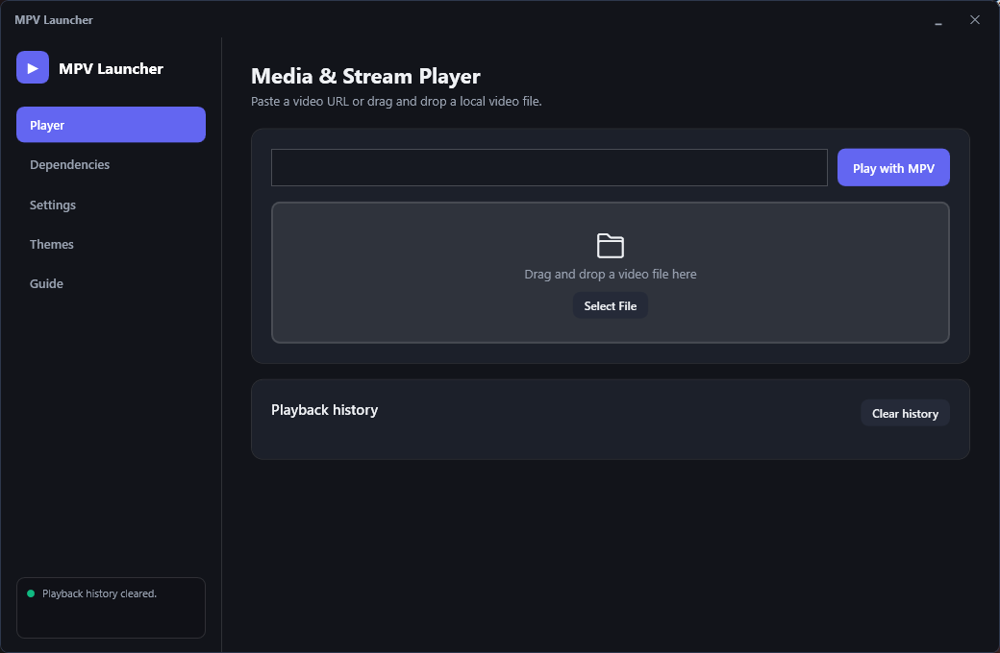
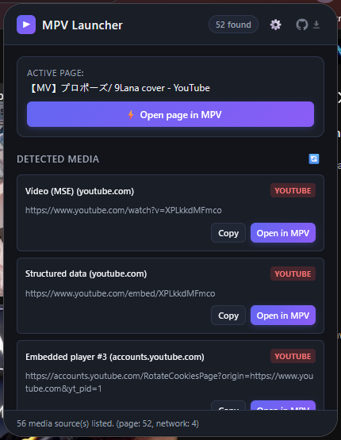

<h1 align="center">MPVLauncher</h1>

<p align="center">Tarayıcıdaki her videoyu <a href="https://mpv.io/"><b>mpv</b></a>'de tek tıkla oynatın.</p>

<p align="center">
<a href="LICENSE"></a>
<a href="extension/manifest.json"></a>
<a href="https://addons.mozilla.org/firefox/addon/mpv-launcher/"></a>
</p>

<p align="center"><a href="README.md">🌐 English</a> · Türkçe</p>

> 🤖 Bu proje yapay zekâ desteğiyle yazıldı — uygulama, eklenti, dokümantasyon ve
> testler — ve bir insan tarafından gözden geçirildi. Kodu okumaya, çalıştırmaya
> ve değiştirmeye açıktır.

---

## 📸 Nasıl görünüyor

| 🖥️ Masaüstü uygulaması | 🧩 Tarayıcı eklentisi |
| :---: | :---: |
|  |  |

---

## 🎬 Ne yapar

MPVLauncher, [mpv](https://mpv.io/) için küçük bir başlatıcıdır; yanında da web'deki
videoyu doğrudan oynatıcınıza gönderen bir tarayıcı eklentisi bulunur.

Normalde tarayıcıdan bir video açmak için indirme aracı, betik ya da sayfaya özel
bir yöntem gerekir. Bu proje bunu tek tıkla hâle getirir.

- 📥 **mpv'nin ihtiyacı olanları kurar** — mpv, yt-dlp ve FFmpeg'i kendi resmî
  yayınlarından. Python yok, harici çalışma zamanı yok, sisteme kurulum yok.
- 🔌 **Eklentiyi kurar** — Chrome, Edge, Brave, Opera, Vivaldi, Yandex ve Firefox
  için; uygulama klasörü taşınırsa onarır.
- 🎨 **Temalar ve görünüm düzenleyici** — 4 tema, özel renkler, bulanıklık, köşe
  yuvarlaklığı ve arka plan görseli.
- ✨ **Anime4K ve ModernZ** — anime yükseltme ve daha güzel ekran üstü kontrol.
- 🗂️ **Oynatma geçmişi** — son 50 kayıt, eklentiyle paylaşılır.
- 🌍 **12 dil** uygulamada, **13 dil** eklentide.

### 🔍 Eklenti neleri bulur

- **Bağımsız iki algılama katmanı.** Bir ağ dinleyicisi sayfanın yaptığı her medya
  isteğini yakalar; bir içerik betiği henüz yüklenmemiş akışları işaretleme içinde
  arar. Sonuçlar birleştirilir, böylece tembel yüklenen bir oynatıcının arkasında
  kalan akışı kaçırmazsınız.
- **Yaygın durumlar** — HLS/m3u8, DASH, doğrudan dosyalar, `<video>` ve `<source>`,
  `object`/`embed` oynatıcıları, JSON-LD, blob ve MSE adresleri.
- **iframe'ler** — başka siteden gelen gömülü oynatıcılar listelenir; başka bir
  sayfadaki YouTube gömmesi de çalışır.
- **Filtreler** — akışları, dosyaları ve iframe'leri ayrı açıp kapatma, en küçük
  boyut belirleme, ilgilenmediğiniz sunucuları gizleme.
- **Daha anlaşılır hatalar** — bir captcha veya Cloudflare doğrulaması "boş sayfa"
  yerine olduğu gibi bildirilir.

---

## 🚀 Hızlı başlangıç

1. [Son sürümden](https://github.com/vegasline/MPVLauncher/releases/latest)
   **MPVLauncher.exe** dosyasını indirin ve açın.
2. **Bağımlılıklar** sekmesine geçin ve **mpv**, **yt-dlp** ile **FFmpeg** için
   **İndir & Kur**'a tıklayın — üç ayrı düğme, üçünü de kurun. mpv oynatıcının
   kendisidir; diğer ikisi bir akış adresini açabilmesi için gereklidir. Aynı
   sekmede **Tema+anime4k Kur** düğmesi ModernZ arayüzünü ve Anime4K shader
   setini `%APPDATA%\mpv` içine kurar.
3. Yine **Bağımlılıklar** sekmesinde **Eklentileri hazırla / onar**'a tıklayarak
   tarayıcı eklentisini kurun. Aynı sekmede eklenti sayfasını açan
   **🦊 Firefox Eklentisi** ve Chromium'un ihtiyaç duyduğu klasörü açan
   **Eklenti Klasörünü Aç** düğmeleri de var.

**Yönetici hakkı gerekmez.** Her şey `%APPDATA%\MPVLauncher\` ve
`HKEY_CURRENT_USER` altına yazılır.

> 💡 Düğme adları arayüz diline göre değişir; arayüzü Türkçe dışında bir dile
> alırsanız İngilizce görünürler.

---

## 🎮 Nasıl kullanılır

İki yol var ve ikisi de aynı mpv'de sonlanır.

**🧩 Tarayıcıdan** — herhangi bir sayfada eklenti simgesine tıklayın. Bulduğu
her şey **Open in MPV** düğmesiyle listelenir: gerçek akış, doğrudan medya
dosyaları ve gömülü oynatıcılar. Birini seçin, açılsın.

**🖥️ Programdan** — **Oynatıcı** sekmesini açın, video adresini yapıştırın ve
**MPV ile Oynat**'a basın. Dosyeyi pencereye sürükleyip bırakabilir veya
**Dosya Seç**'i kullanabilirsiniz.

Hangisini kullanırsanız kullanın, son 50 oynatma **Oynatıcı** sekmesindeki
geçmişte kalır ve iki yol arasında ortaktır.

---

### 🦊 Firefox

İmzalı eklentiyi
[addons.mozilla.org](https://addons.mozilla.org/firefox/addon/mpv-launcher/)
adresinden kurun — en kolay yol bu ve doğrudan çalışır. Manifest V3 desteği için
Firefox 128+ gerekir.

### 🌐 Chrome, Edge, Brave, Opera, Vivaldi, Yandex

Kurulumu yaptıktan sonra `chrome://extensions` adresini açın,
**Geliştirici modu**'nu etkinleştirin, **Paketlenmemiş öğe yükle**'yi seçin ve şu
klasörü gösterin:

```
%APPDATA%\MPVLauncher\extensions\chromium
```

Uygulamadaki **Eklenti Klasörünü Aç** düğmesi bu klasörü sizin için açar.

> 💡 Chromium paketlenmemiş eklenti istediği için eklentinin her açılışta
> yüklenmesi gerekir. Kurulum, bunu tarayıcının başlatma komutuna kullanıcı
> düzeyinde geçersiz kılmalar yazarak halleder — yönetici hakkı gerekmez ve
> tarayıcının güncelleme sırasında yaptığı hiçbir şey bunu geri almaz. Kaldırma
> yalnızca bu değerleri siler.

---

## 🔒 Gizlilik

Eklenti gezdiğiniz sayfalardan adres okur; bu yüzden sınırları açıkça
belirtmek gerekir:

- 🔑 **Kimlik bilgileri hiçbir zaman yakalanmaz.** `Cookie` ve `Authorization`
  daha ilk adımda elenir. Bu yüzden giriş gerektiren bir video mpv'de açılmaz —
  bu bilinçli bir tercihtir.
- 🚫 **Sayfa betiği çalıştırılmaz.** Paketlenmiş oynatıcı betikleri metin olarak
  ayrıştırılır, hiçbir zaman `eval` veya `new Function`'a verilmez.
- 🔒 **Yalnızca `http` ve `https`** oynatıcıya ulaşır ve her argüman düzgün
  alıntılanır; böylece bir adres ek mpv seçeneği sıkıştıramaz.
- 📦 **Arşiv çıkarma sınırlıdır**, indirmeler boyut sınırına tabidir ve imzalı
  medya adreslerinin erişim anahtarı günlüğe yazılmaz.

Ayrıntılar:
[`MpvLauncher.Gui/Services/NativeHostService.cs`](MpvLauncher.Gui/Services/NativeHostService.cs)

---

## ⌨️ Anime4K kısayolları (mpv içinde)

| Tuş | İşlev |
| --- | --- |
| `Ctrl+0` | Anime4K'yı kapat |
| `Ctrl+1` | Mod A (hızlı) |
| `Ctrl+2` | Mod B (yüksek kalite) |
| `Ctrl+3` | Mod C (çok hızlı) |
| `Ctrl+4` | Mod A+A |
| `Ctrl+5` | Mod B+B |
| `Ctrl+6` | Mod C+A |

---

## 🛠️ Kaynaktan derleme

.NET 10 SDK'si gerekir. Node.js yalnızca eklenti testleri için.

```powershell
dotnet build MpvLauncher.Gui\MpvLauncher.Gui.csproj -c Debug
```

Eklenti çalıştırılabilir dosyanın içine gömülüdür; bu yüzden bir değişikliğin
`%APPDATA%` klasörüne ulaşması için C# projesinin yeniden derlenmesi gerekir.
Ardından uygulamada **Eklentileri hazırla / onar**'ı yeniden çalıştırın.

```powershell
node tools\extension-tests.js   # 147 kontrol - eklenti mantığı ve güvenlik
node tools\locale-tests.js      #  29 kontrol - dil dosyaları tutarlı kalır
```

---

## 🌍 Diller

**Uygulama (12):** English, Türkçe, Deutsch, Español, Bahasa Indonesia, 日本語,
한국어, Polski, Português (Brasil), Русский, Tiếng Việt, 中文 (简体)

**Eklenti (13):** aynı liste, artı Français.

---

## 🙏 Teşekkürler

- [mpv](https://mpv.io/) — bu projenin var olma sebebi olan oynatıcı
- [yt-dlp](https://github.com/yt-dlp/yt-dlp) — akış çıkarımı
- [FFmpeg](https://ffmpeg.org/) — ayrıştırma ve dönüştürme
- [Anime4K](https://github.com/bloc97/Anime4K) — gerçek zamanlı anime yükseltme
- [ModernZ](https://github.com/Samillion/ModernZ) — mpv için modern OSC
- [SharpCompress](https://github.com/adamhathcock/sharpcompress) — arşiv çıkarma

## 📄 Lisans

[MIT](LICENSE)
